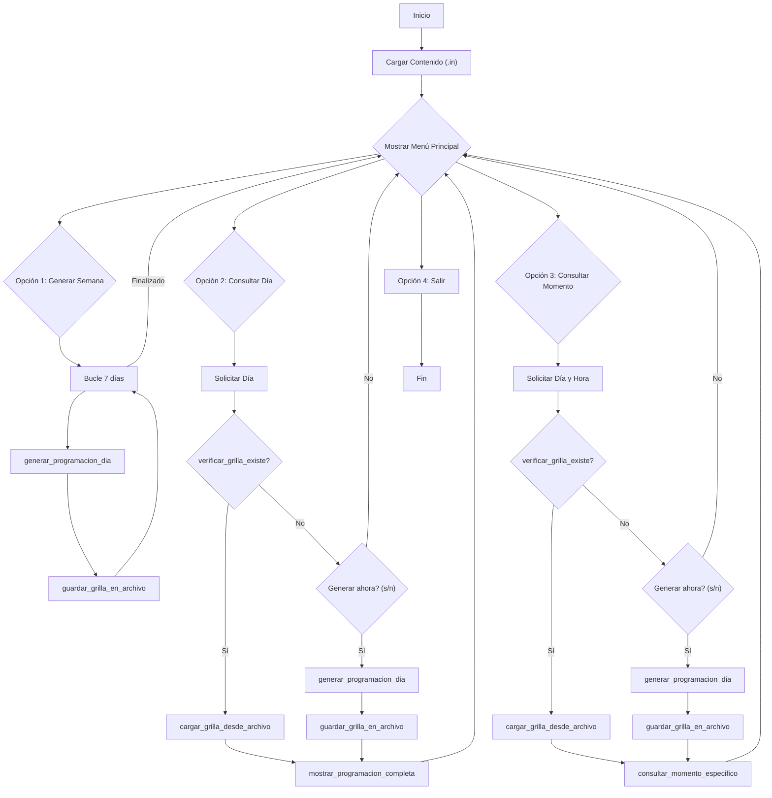

# Éxitos FM - Planificador de Programación Automático

## Descripción del Proyecto

Este proyecto es una solución de software "inteligente" diseñada para la emisora radial Éxitos FM. Su objetivo principal es automatizar la creación de la parrilla de programación diaria y semanal, optimizando el rating al asignar estratégicamente canciones, shows y publicidad en los horarios más convenientes.

El software cuenta con **persistencia de datos**: las grillas generadas se guardan en archivos de salida (`output/grilla_*.out`) y se leen en futuras ejecuciones, evitando la necesidad de regenerar la programación cada vez que se realiza una consulta.

## Arquitectura del Proyecto

El sistema está desarrollado en C y sigue una arquitectura modular simple.

### Componentes Principales:

1.  **Módulo de Carga de Contenido:**
    *   Funciones: `leer_canciones()`, `leer_publicidad()`, `leer_shows()`.
    *   Responsabilidad: Leer los archivos `.in` para cargar el contenido disponible en memoria.

2.  **Motor de Planificación (`generar_programacion_dia()`):**
    *   Es el núcleo del sistema. Su lógica se divide en dos fases:
        1.  **Planificación Estratégica de Shows:** Primero, asigna los shows más importantes (por `preferencia`) a los bloques de mayor audiencia (mañana, mediodía, noche) para maximizar el rating.
        2.  **Generación de Grilla:** Luego, inserta estos bloques de shows en la parrilla y rellena el tiempo restante con canciones (evitando repeticiones cercanas) y publicidad.

3.  **Módulo de Persistencia:**
    *   Funciones: `verificar_grilla_existe()`, `cargar_grilla_desde_archivo()`, `guardar_grilla_en_archivo()`.
    *   Responsabilidad: Manejar el guardado y la carga de las grillas en archivos `output/grilla_*.out`, asegurando que la programación no se pierda entre ejecuciones.

4.  **Interfaz de Usuario (CLI en `main()`):**
    *   Un menú interactivo que permite al usuario generar la programación, consultar la parrilla de un día completo o ver qué está sonando en un momento específico.

### Estructuras de Datos:

El programa utiliza `structs` para modelar las entidades: `Cancion`, `Publicidad`, `Show`, `ElementoProgramacion` y la estructura auxiliar `BloqueEstelar` para la planificación.

## Diagrama de Flujo del Proyecto

## Guía de Troubleshooting

**Problema: El programa muestra "Error: No se pudo abrir [archivo].in"**
*   **Causa:** El programa no encuentra los archivos de contenido en `tests/files/`.
*   **Solución:** Asegúrese de que los archivos `.in` existan en la ruta correcta.

**Problema: Los archivos `grilla_*.out` no se generan o no se encuentran.**
*   **Causa:** Permisos de escritura insuficientes en el directorio `output/` o el directorio no existe.
*   **Solución:** Asegúrese de que la carpeta `output/` exista en la raíz del proyecto y que tenga permisos de escritura.