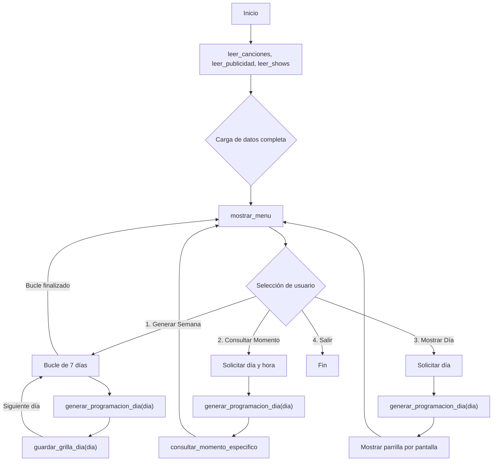
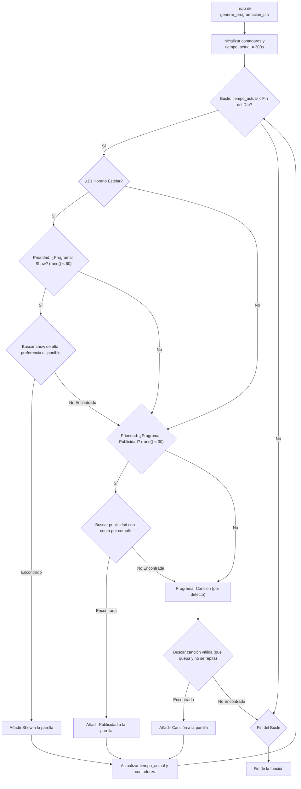

# Documentación de Funciones del Proyecto

Este documento ofrece una explicación detallada de cada una de las funciones implementadas en el sistema de planificación de Éxitos FM. Se incluye su propósito, parámetros, valores de retorno, lógica interna y diagramas de flujo para ilustrar su funcionamiento.

## Librerías Utilizadas

El proyecto utiliza las siguientes librerías estándar de C:

*   `<stdio.h>`: Para operaciones de entrada y salida, como leer los archivos `.in` y escribir los `.out`, además de la interacción por consola.
*   `<string.h>`: Para la manipulación de cadenas de texto, fundamentalmente `strcpy` para copiar nombres y `strrchr` y `strtok` para el parseo de las líneas en los archivos de entrada.
*   `<stdlib.h>`: Provee funciones para la conversión de texto a números (`atoi`), gestión de memoria dinámica y, crucialmente, para la generación de números aleatorios (`rand` y `srand`).
*   `<time.h>`: Utilizada para obtener la hora actual (`time()`), que sirve como semilla para el generador de números aleatorios, asegurando que la programación varíe en cada ejecución.

---

## Diagrama de Flujo General del Programa

Este diagrama ilustra el flujo de ejecución principal desde que el programa inicia hasta que termina.

---

## Funciones de Lectura de Archivos

Estas funciones se encargan de abrir, leer y parsear los archivos de entrada.

### `void leer_canciones()`
*   **Propósito:** Lee el archivo `tests/files/canciones1.in` para cargar la información de todas las canciones en el array global `canciones[]`.
*   **Parámetros:** Ninguno.
*   **Retorno:** `void` (ninguno). Modifica las variables globales `canciones[]` y `num_canciones`.
*   **Lógica:**
    1.  Abre el archivo en modo lectura.
    2.  Lee la primera línea para obtener el número total de canciones.
    3.  Itera esa cantidad de veces, leyendo línea por línea.
    4.  Para cada línea, utiliza `strrchr` para encontrar el último espacio y así parsear la línea de atrás hacia adelante (Puntuación -> Segundos -> Minutos -> Nombre), lo que simplifica la extracción del nombre si este contiene espacios.
    5.  Calcula y almacena la duración total en segundos (`duracion_segundos`).

### `void leer_publicidad()`
*   **Propósito:** Lee el archivo `tests/files/publicidad1.in` para cargar los datos de los patrocinadores en el array global `publicidades[]`.
*   **Parámetros:** Ninguno.
*   **Retorno:** `void`. Modifica `publicidades[]` y `num_publicidades`.
*   **Lógica:**
    1.  Abre el archivo.
    2.  Lee línea por línea hasta el final del archivo (`fgets`).
    3.  Al igual que con las canciones, parsea cada línea de atrás hacia adelante para extraer `Veces`, `Segundos` y `Empresa`.

### `void leer_shows()`
*   **Propósito:** Lee el archivo `tests/files/shows1.in` para cargar la información de los shows en el array global `shows[]`.
*   **Parámetros:** Ninguno.
*   **Retorno:** `void`. Modifica `shows[]` y `num_shows`.
*   **Lógica:** Similar a `leer_canciones`, lee la cantidad de shows y luego itera, parseando cada línea de atrás hacia adelante para extraer los campos.

---

## Funciones del Motor de Planificación

El núcleo lógico del sistema.

### `int puede_repetir_cancion(int cancion_idx, int tiempo_actual, int ultima_reproduccion[])`
*   **Propósito:** Verifica si una canción específica puede ser reproducida en un momento dado, basándose en la regla de no repetición de 4 horas.
*   **Parámetros:**
    *   `cancion_idx`: Índice de la canción a verificar.
    *   `tiempo_actual`: El tiempo actual de la parrilla (en segundos).
    *   `ultima_reproduccion[]`: Un array que almacena el momento en que cada canción fue reproducida por última vez.
*   **Retorno:**
    *   `1` (verdadero) si la canción nunca se ha reproducido o si han pasado más de 4 horas (14400 segundos) desde su última reproducción.
    *   `0` (falso) en caso contrario.

### `void generar_programacion_dia(int dia_semana)`
*   **Propósito:** Genera la parrilla de programación completa para un día.
*   **Parámetros:**
    *   `dia_semana`: Un número del 0 al 6 que representa el día. Se usa para inicializar la semilla de `rand()` y así generar una parrilla diferente cada día.
*   **Retorno:** `void`. El resultado se almacena en el array global `programacion_dia[]`.
*   **Lógica y Diagrama de Flujo:** Esta es la función más compleja. Opera en un bucle que avanza el `tiempo_actual` desde las 00:05:00 hasta llenar el día.

---

## Funciones de Salida y Consulta

### `void guardar_grilla_dia(int dia_semana)`
*   **Propósito:** Escribe el contenido del array `programacion_dia[]` a un archivo de salida `grilla_{dia}.out`.
*   **Parámetros:**
    *   `dia_semana`: El número del día, usado para construir el nombre del archivo (e.g., `grilla_lunes.out`).
*   **Retorno:** `void`.
*   **Lógica:**
    1.  Construye el nombre del archivo.
    2.  Abre el archivo en modo escritura.
    3.  Itera sobre `programacion_dia[]` y, para cada elemento, convierte la `hora_inicio` (en segundos) al formato `HH MM SS` y lo escribe en el archivo junto con el tipo y el nombre.

### `void consultar_momento_especifico(int dia, int hora, int minuto, int segundo)`
*   **Propósito:** Muestra por pantalla qué se está transmitiendo en un momento exacto.
*   **Parámetros:** El día y la hora, minuto y segundo a consultar.
*   **Retorno:** `void`.
*   **Lógica:**
    1.  Convierte la hora de la consulta a segundos totales (`tiempo_busqueda`).
    2.  Itera sobre la `programacion_dia[]` (que ya debe haber sido generada para ese día).
    3.  Busca un `ElementoProgramacion` cuyo intervalo `[hora_inicio, hora_inicio + duracion)` contenga el `tiempo_busqueda`.
    4.  Si lo encuentra, imprime la información detallada de ese elemento. Si no, indica que no hay nada programado.

### `void mostrar_menu()`
*   **Propósito:** Imprime en pantalla las opciones disponibles para el usuario.
*   **Parámetros:** Ninguno.
*   **Retorno:** `void`.

### `int main()`
*   **Propósito:** Es el punto de entrada del programa. Orquesta la ejecución de todas las demás funciones.
*   **Lógica:**
    1.  Llama a las funciones de lectura para cargar todos los datos.
    2.  Entra en un bucle `do-while` que muestra el menú y espera la entrada del usuario.
    3.  Utiliza una estructura `switch` para llamar a las funciones correspondientes según la opción elegida por el usuario.
    4.  El bucle termina cuando el usuario selecciona la opción de salir (4).
*   **Retorno:** `0` si el programa finaliza correctamente.
