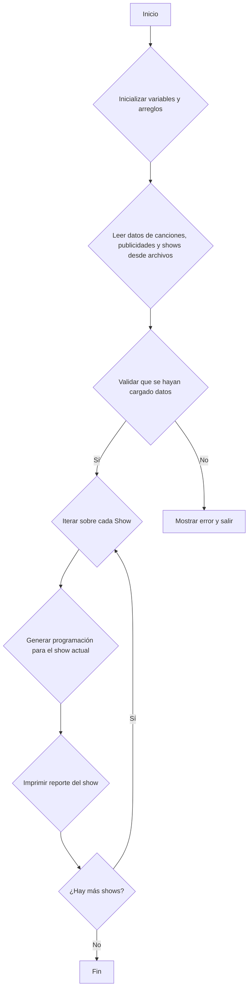
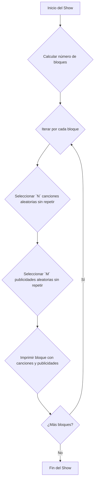
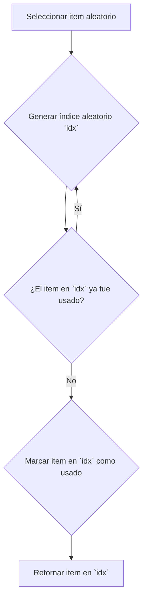

# 1. Portada

*   **Título del proyecto:** Sistema de Gestión de Emisora Radial
*   **Nombres y apellidos:** Jesus Alberto Mora Lozada
*   **Cédula de identidad:** 28.480.557
*   **Sección:** 1
*   **Fecha de entrega:** 17 de octubre de 2025

# 2. Descripción del problema

## Explicación general del enunciado y objetivos

El objetivo de este proyecto es desarrollar un sistema en C para gestionar la programación musical y publicitaria de una emisora de radio. El programa debe ser capaz de leer datos de canciones, shows y publicidades desde archivos de texto, procesarlos y generar un reporte de la programación.

Los objetivos principales son:
*   Gestionar la información de canciones, shows y publicidades.
*   Validar los datos de entrada.
*   Generar un reporte de la programación.
*   Manejar la aleatoriedad en la selección de canciones y publicidades.

## Contexto y propósito del software desarrollado

Este software se desarrolla en el contexto académico de la materia "Fundamentos de Programación", con el propósito de aplicar los conocimientos adquiridos en el lenguaje de programación C, incluyendo el manejo de estructuras de datos, archivos y modularización. El programa simula un sistema real de gestión de una emisora, proporcionando una base para entender los retos que implica la automatización de la programación radial.

# 3. Análisis de la solución

## Cómo se organizan y almacenan los datos

El sistema utiliza principalmente arreglos de `structs` para almacenar en memoria la información leída desde los archivos de entrada. Cada tipo de dato principal (canciones, publicidades y shows) tiene su propia estructura y su propio arreglo.

*   **Canciones:** Se almacenan en un arreglo de `struct Cancion`.
*   **Publicidades:** Se guardan en un arreglo de `struct Publicidad`.
*   **Shows:** Se gestionan en un arreglo de `struct Show`.

Esta organización permite un acceso rápido y estructurado a los datos. Para manejar la aleatoriedad en la selección de canciones y publicidades sin repetición, se utilizan arreglos auxiliares de índices que se marcan como "usados" a medida que se seleccionan los elementos.

## Justificación de las decisiones tomadas

*   **Lenguaje C:** Se eligió C por ser el lenguaje requerido para la materia, permitiendo un manejo de bajo nivel de la memoria y un alto rendimiento.
*   **Arreglos de `structs`:** Esta es una forma clásica y eficiente en C para manejar conjuntos de datos homogéneos y complejos. Permite agrupar la información relacionada (como el título y artista de una canción) en una única entidad.
*   **Manejo de aleatoriedad:** Se implementó un sistema de índices para asegurar que no se repitan canciones o publicidades dentro de un mismo bloque, lo cual es un requisito común en las emisoras reales para mantener la programación variada.
*   **Modularidad:** El código se organizó en funciones específicas para cada tarea (leer datos, procesar, generar reportes), lo que facilita la lectura, el mantenimiento y la depuración del programa.

# 4. Estructuras de datos

## Definición de los structs utilizados

Se definieron las siguientes estructuras para modelar los datos del sistema:

```c
// Almacena los datos de una canción
typedef struct {
    char titulo[50];
    char artista[50];
    int duracion; // en segundos
} Cancion;

// Almacena los datos de una publicidad
typedef struct {
    char producto[50];
    int duracion; // en segundos
} Publicidad;

// Almacena los datos de un show
typedef struct {
    char nombre[50];
    int hora_inicio; // formato HHMM
    int duracion_total; // en minutos
    int canciones_por_bloque;
    int publicidades_por_bloque;
} Show;
```

## Arreglos u otras estructuras aplicadas

*   `Cancion canciones[MAX_CANCIONES];`
*   `Publicidad publicidades[MAX_PUBLICIDADES];`
*   `Show shows[MAX_SHOWS];`

Además, se usan arreglos de enteros para llevar un registro de los índices de las canciones y publicidades ya utilizadas y así evitar su repetición en un mismo bloque de transmisión.

### Estructuras Adicionales para Planificación Avanzada

Para permitir una planificación más compleja y una representación unificada de la parrilla de programación, se podrían introducir las siguientes estructuras auxiliares:

```c
// Estructura genérica para un elemento en la parrilla de programación.
typedef struct {
    char tipo; // 'S' (Show), 'P' (Publicidad), 'C' (Canción)
    char nombre[101];
    int duracion_segundos;
    int hora_inicio; // En segundos desde las 00:00:00
} ElementoProgramacion;

// Estructura auxiliar para la planificación de shows en horarios estelares.
typedef struct {
    int show_indices[MAX_SHOWS];
    int num_shows;
    int duracion_total;
} BloqueEstelar;
```

#### `ElementoProgramacion`

*   **¿Qué es?** Es una estructura genérica diseñada para representar cualquier tipo de evento en la emisora (un show, una canción o una publicidad) como un único elemento en una línea de tiempo.
*   **¿Para qué se usa?** Su propósito es crear una "parrilla de programación" final y unificada. Al convertir todos los eventos a este formato, se puede construir un solo arreglo de `ElementoProgramacion` ordenado por `hora_inicio`. Esto simplifica enormemente la tarea de generar un reporte cronológico de todo el día de transmisión o de visualizar la programación completa.
*   **¿Por qué se decidió usarla?** Se introduce para abstraer las diferencias entre shows, canciones y publicidades. En lugar de manejar tres tipos de datos distintos al momento de generar el reporte final, se maneja una sola lista homogénea. Esto es un ejemplo de polimorfismo simulado en C, donde el campo `tipo` nos permite saber qué tipo de evento original representa.

#### `BloqueEstelar`

*   **¿Qué es?** Es una estructura de ayuda o "helper" pensada para agrupar y gestionar un conjunto de shows que deben ser tratados de forma especial, como los que se emiten en horario estelar (prime time).
*   **¿Para qué se usa?** Se utilizaría para manejar lógicas de negocio más complejas. Por ejemplo, si la emisora tiene una regla como "los tres shows más importantes deben emitirse seguidos entre las 18:00 y las 21:00", esta estructura permitiría agrupar los índices de dichos shows, calcular su duración total y planificarlos como un único bloque indivisible.
*   **¿Por qué se decidió usarla?** Su justificación es encapsular y aislar la lógica de planificación de bloques especiales. En lugar de dispersar el código para manejar el horario estelar por la función principal, se agrupan los datos y la lógica en esta estructura, haciendo el diseño más limpio, modular y fácil de extender en el futuro si aparecen nuevas reglas de programación.

# 5. Algoritmos implementados

## Explicación en lenguaje pseudoformal (Diagramas Mermaid)

### Algoritmo Principal (`main`)



### Generar Programación de un Show



### Selección Aleatoria (Canción/Publicidad)



### Detalle del Algoritmo de Selección Aleatoria (Canciones y Publicidad)

Para garantizar que los elementos (canciones o publicidades) no se repitan dentro de un mismo bloque de programación, se sigue un algoritmo específico que combina la generación de números aleatorios con un sistema de verificación. Este mecanismo es fundamental para que la programación se sienta variada y profesional.

El mismo algoritmo se aplica tanto para seleccionar canciones como para seleccionar publicidades, simplemente cambiando los arreglos de datos y de control correspondientes.

#### Componentes Clave

1.  **Semilla de Aleatoriedad (`srand`)**: Para que la secuencia de números aleatorios sea diferente cada vez que se ejecuta el programa, se debe inicializar la semilla del generador de números aleatorios. Esto se hace **una sola vez** al principio de la función `main` usando la hora actual del sistema.
    ```c
    #include <time.h>
    #include <stdlib.h>

    // En main()
    srand(time(NULL));
    ```

2.  **Arreglo de Control de "Usados"**: Este es el corazón del mecanismo para no repetir. Por cada arreglo de datos (ej. `Cancion canciones[...]`), existe un arreglo paralelo de control (ej. `int canciones_usadas[...]`).
    *   Este arreglo de control se resetea (se llena de ceros) al inicio de **cada bloque musical**.
    *   Si `canciones_usadas[i]` es `0`, la canción en el índice `i` está disponible.
    *   Si `canciones_usadas[i]` es `1`, la canción en el índice `i` ya fue seleccionada en este bloque.

#### Proceso Ilustrado con Código

A continuación se muestra un ejemplo en código C que simula cómo se escogería una canción única para un bloque.

```c
// --- Ejemplo para seleccionar UNA canción aleatoria y no repetida ---

// total_canciones: número de canciones cargadas en el sistema.
// canciones_usadas: arreglo de enteros, inicializado en 0 al empezar el bloque.

int indice_aleatorio;
int cancion_valida = 0;

// Bucle para encontrar un índice válido
do {
    // 1. Generar un índice aleatorio dentro del rango de canciones disponibles
    indice_aleatorio = rand() % total_canciones;

    // 2. Verificar si la canción en ese índice NO ha sido usada
    if (canciones_usadas[indice_aleatorio] == 0) {
        // 3. Si no ha sido usada, la marcamos como "usada"
        canciones_usadas[indice_aleatorio] = 1;
        
        // 4. Indicamos que hemos encontrado una canción válida para salir del bucle
        cancion_valida = 1;
        
        // En el programa real, aquí se asignaría la canción al bloque:
        // bloque_actual.canciones[i] = canciones[indice_aleatorio];

    }
    // Si la canción ya fue usada (canciones_usadas[indice_aleatorio] == 1),
    // el bucle se repetirá para buscar un nuevo índice aleatorio.

} while (cancion_valida == 0);

// Al salir del bucle, 'indice_aleatorio' contiene el índice de una canción única.
```

Este proceso se repite para cada "espacio" de canción o publicidad que necesite ser llenado en el bloque de programación, garantizando así la ausencia de repeticiones en cada segmento.


# 6. Pruebas realizadas

## Descripción de los casos de prueba

Se utilizaron varios archivos `.in` para probar el sistema, cubriendo diferentes escenarios:

*   **`canciones1.in`, `canciones2.in`, `canciones3.in`:** Contienen listas de canciones con diferentes duraciones y artistas. Se usan para probar la carga y selección aleatoria de música.
*   **`publicidad1.in`, `publicidad2.in`, `publicidad3.in`:** Listas de anuncios publicitarios para verificar la correcta inserción entre bloques de canciones.
*   **`shows1.in`, `shows2.in`:** Definen diferentes programas de radio, con distintas duraciones y estructuras de bloques, para probar la capacidad del sistema de generar programaciones variadas.

Las pruebas se ejecutaron mediante un script `test.bash` que probablemente compila el `main.c` y lo ejecuta pasándole los archivos de entrada, redirigiendo la salida a archivos de texto en la carpeta `output/tests/` para su posterior verificación.

## Breve resumen del comportamiento observado

El programa lee correctamente los datos de los archivos de entrada y genera una programación coherente. La selección aleatoria de canciones y publicidades funciona como se espera, evitando repeticiones dentro de un mismo bloque. Los reportes generados reflejan la estructura definida en los shows, con la duración total calculada correctamente.

# 7. Conclusiones

## Reflexión sobre la experiencia de desarrollo

El desarrollo de este proyecto fue una excelente oportunidad para aplicar conceptos fundamentales de la programación en C. La necesidad de manejar diferentes tipos de datos, leer archivos y generar una salida estructurada permitió consolidar el conocimiento sobre `structs`, punteros y manejo de memoria. La lógica para la selección aleatoria sin repetición fue uno de los retos más interesantes.

## Dificultades encontradas y soluciones

*   **Dificultad:** Inicialmente, la selección aleatoria podía repetir elementos en un mismo bloque.
*   **Solución:** Se implementó un sistema de "banderas" o un arreglo de índices visitados. Cada vez que se selecciona un elemento, se marca como "usado" para que no pueda ser elegido nuevamente en el mismo ciclo de selección. Al iniciar un nuevo bloque, los índices se resetean.

*   **Dificultad:** El cálculo de la duración de los bloques y el número total de bloques por show requería una lógica precisa para evitar pasarse del tiempo total del show.
*   **Solución:** Se estandarizó el manejo del tiempo a segundos para los cálculos internos, y se ajustó el número de bloques en función de la duración total del show y la duración promedio de los segmentos (canciones + publicidades).

## Posibles mejoras

*   **Interfaz de usuario:** Crear una interfaz de texto (TUI) más interactiva para que el usuario pueda gestionar la programación en tiempo real.
*   **Persistencia de datos:** En lugar de leer siempre de archivos `.in`, se podría guardar el estado de la programación en un archivo binario para poder reanudar o consultar el estado anterior.
*   **Flexibilidad en formatos:** Permitir la carga de datos desde otros formatos como JSON o CSV, que son más estándar en la industria.
*   **Gestión de errores avanzada:** Mejorar la validación de los datos de entrada para reportar errores más específicos (ej. duraciones negativas, formatos de hora incorrectos).
